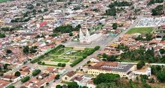

# Portal: Guia de Turismo, cidade de Ceará-Mirim/RN

## Descrição

Este projeto foi realizado por alunas do IFRN — campus Ceará-Mirim, que cursam técnico em informática. O desafio desde projeto era escolher um tema em que o trio se identificassem e desenvolvessem um site usando apenas HTML e CSS ou Javascript (opcional). Decidimos então, criar um guia de turismo (especie de fôlder) da nossa cidade.

## Por que escolhemos criar um portal de turismo para a cidade de Ceará-Mirim?

A ideia surgiu em uma aula de história com a professora Rhayara, que relatou Ceará-Mirim como exemplo, por temos uma riqueza tão imensa de cultura, mas não há uma valorização das pessoas que convivem na cidade. Diante disso, resolvemos criar um site de turismo para que haja uma maior visibilidade da nossa terra, fazendo com que não só, as pessoas de fora a admirem e sim a sua comunidade.

## Participantes do projeto

- [Ângela Samara](https://github.com/angelanunes)
- [Maria Carolina](https://github.com/MariaCarolinass)
- [Maria Fátima](https://github.com/Maria-fatimaa)
- [Sthefany Maniele](https://github.com/Sthefany-Maniele)

## Colaborações futuras

Adicionar interações ao site (JavaScript); Inserir mais informações/imagens sobre a cidade; Outros: Aumentar o projeto adicionando uma Framework; Usar outras tecnologias...

## Imagem da cidade de Ceará-Mirim

